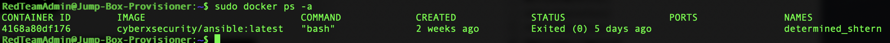

## Automated ELK Stack Deployment

The files in this repository were used to configure the network depicted below.


These files have been tested and used to generate a live ELK deployment on Azure. They can be used to either recreate the entire deployment pictured above. Alternatively, select portions of the Ansible-Playbook elk.yml file may be used to install only certain pieces of it, such as Filebeat.

  - [!Install Elk Playbook](/Files/install-elk.yml)

This document contains the following details:
- Description of the Topology
- Access Policies
- ELK Configuration
  - Beats in Use
  - Machines Being Monitored
- How to Use the Ansible Build


### Description of the Topology

The main purpose of this network is to expose a load-balanced and monitored instance of DVWA, the D*mn Vulnerable Web Application.

Load balancing ensures that the application will be highly available, in addition to restricting inbound traffic to the network.
- The load balancer aids in security by offloading traffic from a corporate server to a public cloud provider. By distributing HTTP traffic between webservers, the webservers and the network will not be overwhelmed by hundreds or even thousands of user requests; this is why load balancers are so crucial in cyber security, as they not only help in applications running smoothly, but also help prevent attacks such as DoS attacks. The advantage of the JumpBox is that is the only means of access to the network and can be only accessed by specific IP addresses. 

Integrating an ELK (Elasticsearch, Logstash, and Kibana) server allows users to easily monitor the vulnerable VMs for changes to the network files and monitor system metrics.
-  Filebeat is a lightweight shipper for forwarding and centralizing log data. Installed as an agent on your servers, Filebeat monitors the log files or locations that you specify, collects log events, and forwards them either to Elasticsearch or Logstash for indexing.
  - When you start Filebeat, it starts one or more inputs that look in the locations you’ve specified for log data. For each log that Filebeat locates, Filebeat starts a harvester. Each harvester reads a single log for new content and sends the new log data to libbeat, which aggregates the events and sends the aggregated data to the output that you’ve configured for Filebeat.
-  Metricbeat is a lightweight shipper that you can install on your servers to periodically collect metrics from the operating system and from services running on the server. Metricbeat takes the metrics and statistics that it collects and ships them to the output that you specify, such as Elasticsearch or Logstash.
  - Metricbeat helps you monitor your servers by collecting metrics from the system and services running on the server, such as: Apache, MongoDB, MySQL, Nginx, PostgreSQL, and Redis
  - Metricbeat can insert the collected metrics directly into Elasticsearch or send them to Logstash, Redis, or Kafka.
  - Metricbeat is an Elastic Beat. It’s based on the libbeat framework.

The configuration details of each machine may be found below.

| Name                | Function   | IP Address    | Operating System |
|---------------------|------------|---------------|------------------|
| JumpBox Provisioner | Gateway    | 10.0.0.4      | Linux            |
| Web-1               | Web Server | 10.0.0.5      | Linux            |
| Web-2               | Web Server | 10.0.0.6      | Linux            |
| Web-3               | Web Server | 10.0.0.7      | Linux            |
| ELK-Server          | Monitoring | 10.1.0.4      | Linux            |

| Applications  | Version                      |
|---------------|------------------------------|
| Docker        | 19.03.6, build 369ce74a3c    |
| Filebeat      | 7.6.1 (amd64), libbeat 7.6.1 |
| Metricbeat    | 7.6.1 (amd64), libbeat 7.6.1 |

### Access Policies

The machines on the internal network are not exposed to the public Internet. 

Only the JumpBox Provisioner machine can accept connections from the Internet. Access to this machine is only allowed from the my personal public IP addresses
- 99.105.215.95

Machines within the network can only be accessed by peer servers and a connection via JumpBox. The Jumpbox Provisioner connects via SSH to the Webservers (Web 1, Web 2 & Web 3) and the ELK Server. The Web Server machines send logs to the ELK Server to be forwarded for indexing. JumpBox Provisioner's public IP address - 52.137.81.241

A summary of the access policies in place can be found in the table below.

| Name                | Publicly Accesible  | Allowed IPs   |
|---------------------|---------------------|---------------|
| JumpBox Provisioner | Yes                 | Personal IP   |
| Web-1               | No                  | 10.0.0.1-254  |
| Web-2               | No                  | 10.0.0.1-254  |
| Web-3               | No                  | 10.0.0.1-254  |
| ELK-Server          | No                  | 10.0.0.1-254  |

### Elk Configuration

Ansible was used to automate configuration of the ELK machine. No configuration was performed manually, which is advantageous because...
- The main advantage is that it automates the process of deploying configurations on multiple web-servers in one shot. It is easier to maintain the servers with ansible if there are for example 100 servers. Patches can be updated easily if there were misconfigurations with ansible-playbooks. Also, Ansible is free

The playbook implements the following tasks:
- 1) Identifies the target machines
- 2) Installs docker.io onto the machines
- 3) Installs pip3 (python3) onto the machines
- 4) Install Docker Python Module
- 5) System Control initated to increase virtual memory on the target machines (DVWAs)
- 6) Launching the Docker Container with Restart Enabled
- 7) Ensuring the correct Ports are enabled (5601, 9200, 5044)

The following screenshot displays the result of running `sudo docker ps -a` after successfully configuring the ELK instance.



### Target Machines & Beats
This ELK server is configured to monitor the following machines:
- 10.0.0.5
- 10.0.0.6
- 10.0.0.7

We have installed the following Beats on these machines:
- FileBeats
- MetricBeats

These Beats allow us to collect the following information from each machine:
- FileBeats is collecting data of the file system and any changes. We use it to monitor our Web Log Data. 
- MetricBeats detects changes in system metrics, such as CPU usage. We use it to detect SSH login attempts, failed sudo escalations, CPU/RAM statistics, and uptime.

### Using the Playbook


In order to use the playbook, you will need to have an Ansible control node already configured. Assuming you have such a control node provisioned: 

SSH into the control node and follow the steps below:

- Copy the configuration file from your Ansible container to your Web VM's

- Update the /etc/ansible/hosts file to include the IP address of the Elk Server VM and webservers.

- Run the playbook, and navigate to http://[Elk_VM_Public_IP]:5601/app/kibana to check that the installation worked as expected.
```[webservers]
      10.0.0.5
      10.0.0.6
      10.0.0.7
     [elk]
      10.1.0.4
  ```
- Which file is the playbook? 
  - The Filebeat-configuration
- Where do you copy it? 
  - copy /etc/ansible/files/filebeat-config.yml to /etc/filebeat/filebeat.yml
- Which file do you update to make Ansible run the playbook on a specific machine? 
  - update filebeat-config.yml 
- How do I specify which machine to install the ELK server on versus which to install Filebeat on?
  - Specify which machine to install by updating the host files with ip addresses of web/elk servers and selecting which group to run on in ansible
- Which URL do you navigate to in order to check that the ELK server is running?
  - http://[your.ELK-VM.External.IP]:5601/app/kibana.


Specific commands the user will need to run to download the playbook, update the files, etc

- git clone <https://github.com/shahcker/ELK-Project-CyberSecurity.git>
- git add .
- git commit -m "VersionX.X"
- git push 