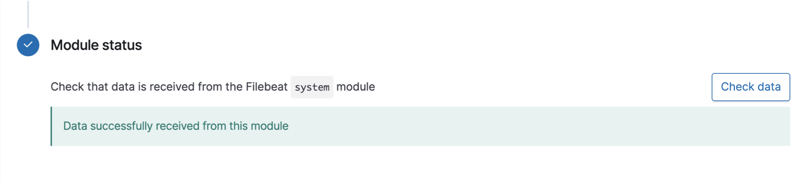

Setup Guide

Before beginning you want to make sure to update -- sudo apt update -- and upgrade -- sudo apt upgrade -- all virtual machines first! This includes the VMs hosting DVWA and ELK containers. This should be the first step in VM creation and maintenance in general, but it is particularly vital in this case as it will interfere with package installation and playbook execution should the systems be out of date.

1. Initial Azure Configurations

a) Create a Resource Group

    By having all or most of our resources in one Virtual Network, the webservers and jumpbox virtual machines will be a part of the same subnet. Placing all resources in one Resource Group is simply good housekeeping and easier to manage. It is best to keep the names consist to avoid confusion (e.g. EXAMPLE-resource-group and EXAMPLE-vnet). 

    

    Simply type in the type of resource intended to create -- for example, "resource group" -- in the search bar. More often than not the top search result will be the right resource. Click on the link and then click "+ Add".

    

    It is necessary to enter a Resource Group name and to select a Region. From there you may select "Review + create" at the bottom of the page, or click "Next: Tags >" to label the Resource Group for further organization (in the case there are multiple Resource Groups). 

b) Setting up the VNet

    Before you can deploy servers and services, there must be a network where these items can be accessed.

        - This network should have the capacity to hold any resource that the Red Team needs, now and in the future.

        - Return to the home screen and search for "net." Choose the search result for Virtual networks.

        - Click on the + Add button on the top-left of the page or the Create virtual network button on the bottom of the page.

    Fill in the network settings:

    - Subscription: Your free subscription should be the only option here. 
        
    - Resource group: This should be the resource group you created in step two.

    - Name: A descriptive name so it will not get confused with other cloud networks in the same account.

    - Region: Make sure to choose the same region you chose for your resource group.

        - Carefully configuring the region of your resources is important for ensuring  low latency and high availability. Resources should be located as close as possible to those who will be consuming them.

        

    - IP Addresses: Azure requires you to define a network and subnet. 
        - Use the defaults on this tab.

        

    - Security: Leave the default settings. 
        - In order to avoid recurring charges, do NOT enable DDoS Protection Standard. 

        
        
    - Tags: No tags are needed. 

    Click Create

    

c) Setting Up Network Security Groups

    Now we need to setup a firewall in front of the VNet to block specific traffic
 
    To create a network security group:

    - On your Azure portal home screen, search "net" and choose **Network security groups**. 

    

    - Create a new security group.

    - Add this security group to your resource group.

    - Give the group a recognizable name that is easy to remember.

    - Make sure the security group is in the same region that you chose during the previous activity.

    

    

   To create an inbound rule to block traffic:

    - Once the security group is created, click on the group to configure it.

    - Choose **Inbound security rules** on the left.

    - Click on the **+ Add** button to add a rule.

    Configure the inbound rule as follows:

    - Source: Choose **Any** source to block all traffic.

    - Source port ranges: Source ports are always random, even with common services like HTTP. Therefore, keep the wildcard (*) to match all source ports.

    - Destination: Select **Any** to block any and all traffic associated with this security group.

    - Destination port ranges: Usually, you would specify a specific port or a range of ports for the destination. In this case, you can use the wildcard (*) to block all destination ports. You can also block all ports using a range like `0-65535`.

    - Protocol: Block **Any** protocol that is used.

    - Action: Use the **Block** action to stop all of the traffic that matches this rule.

    - Priority: This rule will always be the last rule, so it should have the highest possible number for the priority. Other rules will always come before this rule. The highest number Azure allows is 4,096.

    - Name: Give your rule a name like "Default-Deny."

    - Description: Write a quick description similar to "Deny all inbound traffic."

    - Save the rule.

    

    You should now have a VNet protected by a network security group that blocks all traffic.

d) Setting up the Jump Box

    Here we will set up the first virtual machine inside your cloud network, which is protected by the network security group. You will use this machine as a jump box to access your cloud network and any other machines inside your VNet.

    Remember: Allowing a server to use password authentication for SSH is insecure because the password can be brute forced.

    - Therefore, we will only use cryptographic SSH keys to access our cloud servers. Password authentication will not be allowed. 

    - This is part of the "ground up" security approach that we have been discussing. 

    Open your command line and run `ssh-keygen` to create a new SSH key pair.

    - Your output should be similar to:

    ```bash
    cyber@2Us-MacBook-Pro ~ % ssh-keygen
    Generating public/private rsa key pair. 
    Enter file in which to save the key (/Users/cyber/.ssh/id_rsa):
    Enter passphrase (empty for no passphrase): 
    Enter same passphrase again: 
    Your identification has been saved in id_rsa.
    Your public key has been saved in id_rsa.pub.
    The key fingerprint is:
    SHA256:r3aBFU50/5iQbbzhqXY+fOIfivRFdMFt37AvLJifC/0 cyber@2Us-MacBook-Pro.local
    The randomart image is:
    +---[RSA 2048]----+
    |         .. . ...|
    |          o. =..+|
    |         o .o *=+|
    |          o  +oB+|
    |        So o .*o.|
    |        ..+...+ .|
    |          o+++.+ |
    |        ..oo=+* o|
    |       ... ..=E=.|
    +----[SHA256]-----+
    ```

    Run `cat ~/.ssh/id_rsa.pub` to display your `id_rsa.pub` key:

    - Your output should be similar to:

    ```bash
    cyber@2Us-MacBook-Pro ~ % cat ~/.ssh/id_rsa.pub 

    ssh-rsa AAAAB3NzaC1yc2EAAAADAQABAAABAQDGG6dBJ6ibhgM09U+kn/5NE7cGc4CNHWXein0f+MciKElDalf76nVgFvJQEIImMhAGrtRRJDAd6itlPyBpurSyNOByU6LX7Gl6DfGQKzQns6+n9BheiVLLY9dtodp8oAXdVEGles5EslflPrTrjijVZa9lxGe34DtrjijExWM6hBb0KvwlkU4worPblINx+ghDv+3pdrkUXMsQAht/fLdtP/EBwgSXKYCu/
    ```

    - Highlight and copy the SSH key string to your clipboard. 

#### VM 1 - Jump-Box

Open your Azure portal and search for "virtual machines."

- Use the **+ Add** button or the **Create virtual machine** button to create a new VM.

    

Use the following settings for this VM: 

- Resource group: Choose the same resource group that you created for the Red Team.

- Virtual machine name: Use the name "Jump Box Provisioner."

- Region: Use the same region that you used for your other resources.
	- Note that availability of VM's in Azure could cause you to change the region where your VM's are created.
	- The goal is to create 3 machines in the same resource group attached to the same security group. If you cannot add 3 machines to the resource group and security group that you have, a new resource group and security group may need to be created in another region.

- Availability options: We will use this setting for other machines. For our jump box, we will leave this on the default setting.

- Image: Choose the Ubuntu Server 18.04 option.

- Choose the VM option that has:
  - Whose offering is **Standard - B1s**
  - 1 CPU
  - 1 RAM

For SSH, use the following settings: 

- Authentication type: SSH public key.

- Username: Create any username you like.

- SSH public key: Paste the public key string that you copied earlier.

- Public inbound ports: Ignore this setting. It will be overwritten when you choose your security group.

- Select inbound ports: Ignore this setting. It will be overwritten when you choose your security group.


Move to the **Networking** tab and set the following settings:

- Virtual network: Choose the VNet you created for the Red Team.

- Subnet: Choose the subnet that you created earlier.

- Public IP: Choose `Create new` and choose `Static` under Assignment in the side panel. Give the IP Address a unique name.


- NIC network security group: Choose the Advanced option so we can specify our custom security group.

- Configure network security group: Choose your Red Team network security group.

- Accelerated networking: Keep as the default setting (Off).

- In the Networking settings, take note of the VM URL. You may use it later.

- Load balancing: Keep as the default setting (No).

- Click on **Review + create**.

    

- Finalize all your settings and create the VM by clicking on the **Create** button.

#### VM's 2 and 3 - Web VM's

Create 2 more new VMs. Keep the following in mind when configuring these VM's:
- Each VM should be named "Web-1" and "Web-2"

- These VM's need to be in the same resource group you are using for all other resources.

- The VM's should be located in the same region as your resource group and security group.
	- Note that availability of VM's in Azure could cause you to change the region where your VM's are created.
	- The goal is to create 3 machines in the same resource group attached to the same security group. If you cannot add 3 machines to the resource group and security group that you have, a new resource group and security group may need to be created in another region.

- The administrative username should make sense for this scenario. You should use the same admin name for all 3 machines. Make sure to take a note of this name as you will need it to login later.

- You will need to create a new SSH key for remote connections. 

- Choose the VM option that has:
  - Whose offering is **Standard - B1ms**
  - 1 CPU
  - 2 RAM

**Note:** These web machines should have _2 GB_ of RAM and the Jump-Box only needs _1 GB_. All 3 machines should only have _1 vCPU_ because the free Azure account only allows _4 vCPU's_ in total per region.

**Important:** Make sure both of these VM's are in the same availability Set. Under Availability Options, select 'Availability Set'. Click on 'Create New' under the Availability set. Give it an appropriate name. After creating it on the first VM, choose it for the second VM.


In the **Networking** tab and set the following settings:

- Virtual network: Choose the VNet you created for the Red Team.

- Subnet: Choose the subnet that you created earlier.

- Public IP: NONE! Make sure these web VM's do not have a public IP address.


- NIC network security group: Choose the Advanced option so we can specify our custom security group.

- Configure network security group: Choose your Red Team network security group.

- Accelerated networking: Keep as the default setting (Off).

- In the Networking settings, take note of the VM URL. You may use it later.

- Load balancing: Keep as the default setting (No).

**NOTE:** Notice that these machines will not be accessible at this time because our security group is blocking all traffic. We will configure access to these machines in a later activity.

d) JumpBox Administration

We will need to create a security group rule to allow SSH connections only from your current IP address, and to connect to your new virtual machine for management.

---

1. First, find your IP address by opening the terminal and entering the command `curl icanhazip.com`, or googling "What's my IP address?" 

Next, log into portal.azure.com to create a security group rule to allow SSH connections from your current IP address.

2. Find your security group listed under your resource group.

3. Create a rule allowing SSH connections from your IP address. 

    - Choose **Inbound security rules** on the left.

    - Click **+ Add** to add a rule.

        - Source: Use the **IP Addresses** setting, with your IP address in the field.

        - Source port ranges: Set to **Any** or * here.

		- Destination: This can be set **VirtualNetwork** but a better setting is to specify the internal IP of your jump box to really limit this traffic.

        - Destination port ranges: Since we only want to allow SSH, designate port `22`.

        - Protocol: Set to **Any** or **TCP**.

        - Action: Set to **Allow** traffic.

        - Priority: This must be a lower number than your rule to deny all traffic, i.e., less than 4,096. 

        - Name: Name this rule anything you like, but it should describe the rule. For example: `SSH`.

        - Description: Write a short description similar to: "Allow SSH from my IP." 

	

4. Use your command line to SSH to the VM for administration. Windows users should use GitBash.

    - The command to connect is `ssh admin-username@VM-public-IP`.

    - Use the username you previously set up. (Your SSH key should be used automatically.)

5. Once you are connected, check your `sudo` permissions.
    
    - Run the command `sudo -l`.

    - Notice that your admin user has full `sudo` permissions without requiring a password.

Please note that your public IP address will change depending on your location. 

-  In a normal work environment, you would set up a static IP address to avoid continually creating rules to allow access to your cloud machine. 

 - In our case, you will need to create another security rule allowing your home network to access your Azure VM. 

**NOTE:** If you need to reset your SSH key, you can do so in the VM details page by selecting 'Reset Password' on the left had column.

## Containers

Now we need to configure your jump box to run Docker containers and to install a container.

---

1. Start by installing `docker.io` on your Jump box.

    - Run `sudo apt update` then `sudo apt install docker.io`

2. Verify that the Docker service is running.

    - Run `sudo systemctl status docker`

      - **Note:** If the Docker service is not running, start it with `sudo systemctl start docker`.

3. Once Docker is installed, pull the container `cyberxsecurity/ansible`.

    - Run `sudo docker pull cyberxsecurity/ansible`.

    - You can also switch to the root user so you don't have to keep typing `sudo`.

    - Run `sudo su`.


4. Launch the Ansible container and connect to it using the appropriate Docker commands.

    - Run `docker run -ti cyberxsecurity/ansible:latest bash` to start the container.

    - Run `exit` to quit.

5. Create a new security group rule that allows your jump box machine full access to your VNet.

    - Get the private IP address of your jump box.

    - Go to your security group settings and create an inbound rule. Create rules allowing SSH connections from your IP address.

       - Source: Use the **IP Addresses** setting with your jump box's internal IP address in the field.

        - Source port ranges: **Any** or * can be listed here.

        - Destination: Set to **VirtualNetwork**.

        - Destination port ranges: Only allow SSH. So, only port `22`.

        - Protocol: Set to **Any** or **TCP**.

        - Action: Set to **Allow** traffic from your jump box.

        - Priority: Priority must be a lower number than your rule to deny all traffic.

        - Name: Name this rule anything you like, but it should describe the rule. For example: `SSH from Jump Box`.

        - Description: Write a short description similar to: "Allow SSH from the jump box IP."

## SSH with Provisioners

Let us now launch a new VM from the Azure portal that could only be accessed using a new SSH key from the container running inside your jump box.

---

1. Connect to your Ansible container. Once you're connected, create a new SSH key and copy the public key.

    - Run `sudo docker container list -a` to find your image.

    - Run `docker run -it cyberxsecurity/ansible /bin/bash` to start your container and connect to it. (Note that the prompt changes.)

        ```bash
        root@Red-Team-Web-VM-1:/home/RedAdmin# docker run -it cyberxsecurity/ansible /bin/bash
        root@23b86e1d62ad:~#
        ```

    - Run `ssh-keygen` to create an SSH key.

        ```bash
        root@23b86e1d62ad:~# ssh-keygen
        Generating public/private rsa key pair.
        Enter file in which to save the key (/root/.ssh/id_rsa):
        Created directory '/root/.ssh'.
        Enter passphrase (empty for no passphrase):
        Enter same passphrase again:
        Your identification has been saved in /root/.ssh/id_rsa.
        Your public key has been saved in /root/.ssh/id_rsa.pub.
        The key fingerprint is:
        SHA256:gzoKliTqbxvTFhrNU7ZwUHEx7xAA7MBPS2Wq3HdJ6rw root@23b86e1d62ad
        The key's randomart image is:
        +---[RSA 2048]----+
        |  . .o+*o=.      |
        |   o ++ . +      |
        |    *o.+ o .     |
        |  . =+=.+ +      |
        |.. + *.+So .     |
        |+ . +.* ..       |
        |oo +oo o         |
        |o. o+.  .        |
        | .+o.  E         |
        +----[SHA256]-----+
        root@23b86e1d62ad:~#
        ```

    - Run `ls .ssh/` to view your keys.

        ```bash
        root@23b86e1d62ad:~# ls .ssh/
        id_rsa  id_rsa.pub
        ```

    - Run `cat .ssh/id_rsa.pub` to display your public key.

        ```bash
        root@23b86e1d62ad:~# cat .ssh/id_rsa.pub
        ssh-rsa AAAAB3NzaC1yc2EAAAADAQABAAABAQDz5KX3urPPKbYRKS3J06wyw5Xj4eZRQTcg6u2LpnSsXwPWYBpCdF5lE3tJlbp7AsnXlXpq2G0oAy5dcLJX2anpfaEBTEvZ0mFBS24AdNnF3ptan5SmEM/
        ```

    - Copy your public key string.

2. Return to the Azure portal and locate one of your web-vm's details page.

		- Reset your Vm's password and use your container's new public key for the SSH user.

    - Get the internal IP for your new VM from the Details page.


3. After your VM launches, test your connection using `ssh` from your jump box Ansible container.
    - Note: If only TCP connections are enabled for SSH in your security group rule, ICMP packets will not be allowed, so you will not be able to use `ping`.

    ```bash
    root@23b86e1d62ad:~# ping 10.0.0.6
    PING 10.0.0.6 (10.0.0.6) 56(84) bytes of data.
    ^C
    --- 10.0.0.6 ping statistics ---
    4 packets transmitted, 0 received, 100% packet loss, time 3062ms

    root@23b86e1d62ad:~#
    ```

    ```bash
    root@23b86e1d62ad:~# ssh ansible@10.0.0.6
    The authenticity of host '10.0.0.6 (10.0.0.6)' can't be established.
    ECDSA key fingerprint is SHA256:7Wd1cStyhq5HihBf+7TQgjIQe2uHP6arx2qZ1YrPAP4.
    Are you sure you want to continue connecting (yes/no)? yes
    Warning: Permanently added '10.0.0.6' (ECDSA) to the list of known hosts.
    Welcome to Ubuntu 18.04.3 LTS (GNU/Linux 5.0.0-1027-azure x86_64)

    * Documentation:  https://help.ubuntu.com
    * Management:     https://landscape.canonical.com
    * Support:        https://ubuntu.com/advantage

    System information as of Mon Jan  6 18:49:56 UTC 2020

    System load:  0.01              Processes:           108
    Usage of /:   4.1% of 28.90GB   Users logged in:     0
    Memory usage: 36%               IP address for eth0: 10.0.0.6
    Swap usage:   0%


    0 packages can be updated.
    0 updates are security updates.


    Last login: Mon Jan  6 18:33:30 2020 from 10.0.0.4
    To run a command as administrator (user "root"), use "sudo <command>".
    See "man sudo_root" for details.

    ansible@Pentest-1:~$
    ```

    - Exit this SSH session by running `exit`.

4. Locate the Ansible config file and hosts file.


    ```bash
    root@1f08425a2967:~# ls /etc/ansible/
    ansible.cfg  hosts  roles
    ```
     - Add this machine's internal IP address to the Ansible hosts file.

    - Open the file with `nano /etc/ansible/hosts`.
    - Uncomment the `[webservers]` header line.
    - Add the internal IP address under the `[webservers]` header.
		- Add the python line: `ansible_python_interpreter=/usr/bin/python3` besides each IP.

    ```bash
        # This is the default ansible 'hosts' file.
        #
        # It should live in /etc/ansible/hosts
        #
        #   - Comments begin with the '#' character
        #   - Blank lines are ignored
        #   - Groups of hosts are delimited by [header] elements
        #   - You can enter hostnames or ip addresses
        #   - A hostname/ip can be a member of multiple groups
        # Ex 1: Ungrouped hosts, specify before any group headers.

        ## green.example.com
        ## blue.example.com
        ## 192.168.100.1
        ## 192.168.100.10

        # Ex 2: A collection of hosts belonging to the 'webservers' group

        [webservers]
        ## alpha.example.org
        ## beta.example.org
        ## 192.168.1.100
        ## 192.168.1.110
        10.0.0.6 ansible_python_interpreter=/usr/bin/python3
				10.0.0.7 ansible_python_interpreter=/usr/bin/python3
        ```

5. Change the Ansible configuration file to use your administrator account for SSH connections.

    - Open the file with `nano /etc/ansible/ansible.cfg` and scroll down to the `remote_user` option.

    - Uncomment the `remote_user` line and replace `root` with your admin username using this format:
				- `remote_user = <user-name-for-web-VMs>`

	Example:
    ```bash
    # What flags to pass to sudo
    # WARNING: leaving out the defaults might create unexpected behaviours
    #sudo_flags = -H -S -n

    # SSH timeout
    #timeout = 10

    # default user to use for playbooks if user is not specified
    # (/usr/bin/ansible will use current user as default)
    remote_user = sysadmin

    # logging is off by default unless this path is defined
    # if so defined, consider logrotate
    #log_path = /var/log/ansible.log

    # default module name for /usr/bin/ansible
    #module_name = command

    ```

6. Test an Ansible connection using the appropriate Ansible command.

If you used `ansible_python_interpreter=/usr/bin/python3` your output should look like:

```bash
10.0.0.5 | SUCCESS => {
"changed": false, 
"ping": "pong"
}
10.0.0.6 | SUCCESS => {
		"changed": false, 
		"ping": "pong"
}
```

If that line isn't present, you will get a warning like this:

```bash
root@1f08425a2967:~# ansible all -m ping
[DEPRECATION WARNING]: Distribution Ubuntu 18.04 on host 10.0.0.6 should use 
/usr/bin/python3, but is using /usr/bin/python for backward compatibility with 
prior Ansible releases. A future Ansible release will default to using the 
discovered platform python for this host. See https://docs.ansible.com/ansible/
2.9/reference_appendices/interpreter_discovery.html for more information. This 
feature will be removed in version 2.12. Deprecation warnings can be disabled 
by setting deprecation_warnings=False in ansible.cfg.
10.0.0.6 | SUCCESS => {
		"ansible_facts": {
				"discovered_interpreter_python": "/usr/bin/python"
		}, 
		"changed": false, 
		"ping": "pong"
}
```

- Ignore the `[DEPRECATION WARNING]` or add the line `ansible_python_interpreter=/usr/bin/python3` next to each Ip address in the hosts file.

## Ansible Playbooks

Let us now create an Ansible playbook that will install Docker and configure a VM with the DVWA web app.

---

1. Connect to your jump box, and connect to the Ansible container in the box. 

    - If you stopped your container or exited it in the last activity, find it again using `docker container list -a`.

    ```bash
    root@Red-Team-Web-VM-1:/home/RedAdmin# docker container list -a
    CONTAINER ID        IMAGE                           COMMAND                  CREATED             STATUS                         PORTS               NAMES
    Exited (0) 2 minutes ago                           hardcore_brown
    a0d78be636f7        cyberxsecurity/ansible:latest   "bash"                   3 days ago  
    ```

   - Start the container again using `docker start [container_name]`.

    ```bash
    root@Red-Team-Web-VM-1:/home/RedAdmin# docker start hardcore_brown
    hardcore_brown
    ```

   - Get a shell in your container using `docker attach [container_name]`.

    ```bash
    root@Red-Team-Web-VM-1:/home/RedAdmin# docker attach hardcore_brown
    root@1f08425a2967:~#
    ```

2. Create a YAML playbook file that you will use for your configuration. 


  ```bash
  root@1f08425a2967:~# nano /etc/ansible/pentest.yml
  ```

   The top of your YAML file should read similar to:

```YAML
---
- name: Config Web VM with Docker
    hosts: web
    become: true
    tasks:
```

- Use the Ansible `apt` module to install `docker.io` and `python3-pip`:
**Note:** `update_cache` must be used here, or `docker.io` will not install. (this is the equivalent of running `apt update`)

  ```YAML
    - name: docker.io
      apt:
				update_cache: yes
        name: docker.io
        state: present

    - name: Install pip3
      apt:
        force_apt_get: yes
        name: python3-pip
        state: present
  ```

Note: `update_cache: yes` is needed to download and install docker.io

- Use the Ansible `pip` module to install `docker`:

  ```bash
    - name: Install Python Docker module
      pip:
        name: docker
        state: present
  ```

Note: Here we are installing the Python Docker Module, so Ansible can then utilize that module to control docker containers. More about the Python Docker Module [HERE](https://docker-py.readthedocs.io/en/stable/)

- Use the Ansible `docker-container` module to install the `cyberxsecurity/dvwa` container.
  - Make sure you publish port `80` on the container to port `80` on the host.
  ```YAML
    - name: download and launch a docker web container
      docker_container:
        name: dvwa
        image: cyberxsecurity/dvwa
        state: started
        restart_policy: always
        published_ports: 80:80
  ```

NOTE: `restart_policy: always` will ensure that the container restarts if you restart your web vm. Without it, you will have to restart your container when you restart the machine.

You will also need to use the `systemd` module to restart the docker service when the machine reboots. That block looks like this:

```YAML
    - name: Enable docker service
      systemd:
        name: docker
        enabled: yes
```

3. Run your Ansible playbook on the new virtual machine.

    Your final playbook should read similar to:
    ```YAML
    ---
    - name: Config Web VM with Docker
      hosts: webservers
      become: true
      tasks:
      - name: docker.io
        apt:
          force_apt_get: yes
          update_cache: yes
          name: docker.io
          state: present

      - name: Install pip3
        apt:
          force_apt_get: yes
          name: python3-pip
          state: present

      - name: Install Docker python module
        pip:
          name: docker
          state: present

      - name: download and launch a docker web container
        docker_container:
          name: dvwa
          image: cyberxsecurity/dvwa
          state: started
          published_ports: 80:80

      - name: Enable docker service
        systemd:
          name: docker
          enabled: yes
    ```

  - Running your playbook should produce an output similar to the following:

    ```bash
    root@1f08425a2967:~# ansible-playbook /etc/ansible/pentest.yml

    PLAY [Config Web VM with Docker] ***************************************************************

    TASK [Gathering Facts] *************************************************************************
    ok: [10.0.0.6]

    TASK [docker.io] *******************************************************************************
    [WARNING]: Updating cache and auto-installing missing dependency: python-apt

    changed: [10.0.0.6]

    TASK [Install pip3] *****************************************************************************
    changed: [10.0.0.6]

    TASK [Install Docker python module] ************************************************************
    changed: [10.0.0.6]

    TASK [download and launch a docker web container] **********************************************
    changed: [10.0.0.6]

    PLAY RECAP *************************************************************************************
    10.0.0.6                   : ok=5    changed=4    unreachable=0    failed=0    skipped=0    rescued=0    ignored=0   
    ```

4. To test that DVWA is running on the new VM, SSH to the new VM from your Ansible container.

    - SSH to your container:

    ```bash
    root@1f08425a2967:~# ssh sysadmin@10.0.0.6
    Welcome to Ubuntu 18.04.3 LTS (GNU/Linux 5.0.0-1027-azure x86_64)

    * Documentation:  https://help.ubuntu.com
    * Management:     https://landscape.canonical.com
    * Support:        https://ubuntu.com/advantage

      System information as of Mon Jan  6 20:01:03 UTC 2020

      System load:  0.01              Processes:              122
      Usage of /:   9.9% of 28.90GB   Users logged in:        0
      Memory usage: 58%               IP address for eth0:    10.0.0.6
      Swap usage:   0%                IP address for docker0: 172.17.0.1


    18 packages can be updated.
    0 updates are security updates.


    Last login: Mon Jan  6 19:33:51 2020 from 10.0.0.4
    ```

    - Run `curl localhost/setup.php` to test the connection. If everything is working, you should get back some HTML from the DVWA container.

    ```bash
    ansible@Pentest-1:~$ curl localhost/setup.php

    <!DOCTYPE html PUBLIC "-//W3C//DTD XHTML 1.0 Strict//EN" "http://www.w3.org/TR/xhtml1/DTD/xhtml1-strict.dtd">

    <html xmlns="http://www.w3.org/1999/xhtml">

      <head>
        <meta http-equiv="Content-Type" content="text/html; charset=UTF-8" />

        <title>Setup :: Damn Vulnerable Web Application (DVWA) v1.10 *Development*</title>

        <link rel="stylesheet" type="text/css" href="dvwa/css/main.css" />

        <link rel="icon" type="\image/ico" href="favicon.ico" />

        <script type="text/javascript" src="dvwa/js/dvwaPage.js"></script>

      </head>
    ```
## Load Balancing

Install a load balancer in front of the VM to distribute the traffic among more than one VM.

---

1. Create a new load balancer and assign it a static IP address.

    - Start from the homepage and search for "load balancer."


- Click **+ Add** to create a new load balancer.
    - It should have a static public IP address. 
    - Click **Create** to create the load balancer.


2. Add a health probe to regularly check all the VMs and make sure they are able to receive traffic.


3. Create a backend pool and add your VM to it.


## Security Configuration

 Configure the load balancer and security group to work together to expose port `80` of the VM to the internet.

---

1. Create a load balancing rule to forward port `80` from the load balancer to your Red Team VNet.

    - Name: Give the rule an appropriate name that you will recognize later.

    - IP Version: This should stay on **IPv4**.

    - Frontend IP address: There should only be one option here.

    - Protocol: Protocol is **TCP** for standard website traffic.

    - Port: Port is `80`.

    - Backend port: Backend port is also `80`.

    - Backend pool and Health probe: Select your backend pool and your health probe.

    - Session persistence: This should be changed to **Client IP and protocol**. 
        - Remember, these servers will be used by the Red Team to practice attacking machines. If the session changes to another server in the middle of their attack, it could stop them from successfully completing their training.

    - Idle timeout: This can remain the default (**4 minutes**).

    - Floating IP: This can remain the default (**Disabled**).

    


2. Create a new security group rule to allow port `80` traffic from the internet to your internal VNet.

    - Source: Change this your external IPv4 address. 

    - Source port ranges: We want to allow **Any** source port, because they are chosen at random by the source computer.

    - Destination: We want the traffic to reach our **VirtualNetwork**.

    - Destination port ranges: We only want to allow port `80`.

    - Protocol: Set the standard web protocol of **TCP** or **Any**.

    - Action: Set to **Allow** traffic.

    - Name: Choose an appropriate name that you can recognize later.


3. Remove the security group rule that blocks _all_ traffic on your vnet to allow traffic from your load balancer through. 

    - Remember that when we created this rule we were blocking traffic from the allow rules that were already in place. One of those rules allows traffic from load balancers. 
    
    - Removing your default deny all rule will allow traffic through.

4. Verify that you can reach the DVWA app from your browser over the internet.

    - Open a web browser and enter the front-end IP address for your load balancer with `/setup.php` added to the IP address.
    
        - For example: `http://40.122.71.120/setup.php`


**Note:** With the stated configuration, you will not be able to access these machines from another location unless the security Group rule is changed.

## Redundancy

Create a copy of your VM using your Ansible playbook for the configuration, and then place the VM in the backend pool for the load balancer.

1. Launch a new VM in the Azure portal.

    - Name this VM: `Web-3`

    - Be sure to use the same admin name and SSH key from your Ansible container that you used for the current DVWA machine.

    - You may need to start your Ansible container on your jump box to get the key.

        - Run `sudo docker container list -a` to see a list of all the containers (you should only have one), and note the unique name of your container.

        - Run the following commands to start your container and get the key:

        ```bash
        $ sudo docker start your_container_name
        your_container_name
        $ sudo docker attach your_container_name
        $ cat .ssh/id_rsa.pub 
        ssh-rsa AAAAB3NzaC1yc2EAAAADAQABAAABAQDdFS0nrcNG91P3HV60pPCDE0YCKNeS5Kr8edGxCeXUT1SP09Eyxxpi6LPZbL0Nkn8JNtdaxN9qyWG4Xpuh+rzCl9QnnGsdge76muzwl6awVUvRn0IAjM/e3RCKt0e1xSRiGaUY1ch41NY1Dih/MjxPunC2BykSGP17/hgMmLPKe8ZsHVaiFv1SiEqsGHa/
        ```

        - Copy the key into your configuration.

    

    - For your **Availability set**, set **RedTeamAS**.

    - Do not give your new VM an external IP address.
    
    - Do not assign a load balancer.


2. Once your machine is set up, connect to the Ansible container on your jump box and test the Ansible connection using SSH.

    ```bash
    $ ssh ansible@10.0.0.7
    The authenticity of host '10.0.0.7 (10.0.0.7)' can't be established.
    ECDSA key fingerprint is SHA256:Jes0kNsSifAVf/TEcfPxhP4/p2fmS7WGk2O8xo8vC64.
    Are you sure you want to continue connecting (yes/no)? yes

    Warning: Permanently added '10.0.0.7' (ECDSA) to the list of known hosts.

    Welcome to Ubuntu 18.04.3 LTS (GNU/Linux 5.0.0-1027-azure x86_64)
    ```

    - Run `exit` to return to your Ansible container.


3. Add the internal IP address of the new VM to your Ansible configuration.

    - Get the internal IP from the VM details page in Azure:

    

    - On your Ansible container, run `nano /etc/ansible/hosts`.

    - Add the new IP address under the IP of the other VM.
    ```bash
    # Ex 2: A collection of hosts belonging to the 'webservers' group

    [webservers]
    ## alpha.example.org
    ## beta.example.org
    ## 192.168.1.100
    ## 192.168.1.110
    10.0.0.6 ansible_python_interpreter=/usr/bin/python3
    10.0.0.7 ansible_python_interpreter=/usr/bin/python3
		10.0.0.8 ansible_python_interpreter=/usr/bin/python3
    # If you have multiple hosts following a pattern you can specify
    # them like this:
    ```
    - Save and exit the hosts file.

4. Test your Ansible configuration with the Ansible `ping` command.

    - Run `ansible all -m ping` (Ignore `[DEPRECATION WARNING]`.)

    ```bash
    root@1f08425a2967:~# ansible all -m ping

    10.0.0.6 | SUCCESS => {
        "ansible_facts": {
            "discovered_interpreter_python": "/usr/bin/python"
        }, 
        "changed": false, 
        "ping": "pong"
    }

    10.0.0.7 | SUCCESS => {
        "ansible_facts": {
            "discovered_interpreter_python": "/usr/bin/python"
        }, 
        "changed": false, 
        "ping": "pong"
    }
    ```

5. Run your Ansible playbook to configure your new machine.

    **Hint**: If you run your playbook, it will run on both machines. Ansible will recognize your original VM and check its settings. It should only make changes to the new VM.

    - Run `ansible-playbook your-playbook.yml`

    ```bash
    root@1f08425a2967:~# ansible-playbook /etc/ansible/pentest.yml 

    PLAY [Config Web VM with Docker] ****************************************************

    TASK [Gathering Facts] **************************************************************
    ok: [10.0.0.7]
    ok: [10.0.0.6]

    TASK [docker.io] ********************************************************************
    ok: [10.0.0.6]
    [WARNING]: Updating cache and auto-installing missing dependency: python-apt

    changed: [10.0.0.7]

    TASK [Install pip] ******************************************************************
    ok: [10.0.0.6]
    changed: [10.0.0.7]

    TASK [Install Docker python module] *************************************************
    ok: [10.0.0.6]
    changed: [10.0.0.7]

    TASK [download and launch a docker web container] ***********************************
    changed: [10.0.0.6]
    changed: [10.0.0.7] 

    PLAY RECAP **************************************************************************
    10.0.0.6                   : ok=5    changed=1    unreachable=0    failed=0    skipped=0    rescued=0    ignored=0   
    10.0.0.7                   : ok=5    changed=4    unreachable=0    failed=0    skipped=0    rescued=0    ignored=0   
    ```

6. When the Ansible playbook is finished running, SSH to your new VM and test the DVWA app using `curl`.

    - Run `ssh ansible@10.0.0.7`

    - Run `curl localhost/setup.php`

    - Your output should look like the following:

    ```bash
    root@1f08425a2967:~# ssh ansible@10.0.0.7
    Welcome to Ubuntu 18.04.3 LTS (GNU/Linux 5.0.0-1027-azure x86_64)

    * Documentation:  https://help.ubuntu.com
    * Management:     https://landscape.canonical.com
    * Support:        https://ubuntu.com/advantage

    System information as of Fri Jan 10 21:01:52 UTC 2020

    System load:  0.24              Processes:              122
    Usage of /:   9.9% of 28.90GB   Users logged in:        0
    Memory usage: 57%               IP address for eth0:    10.0.0.7
    Swap usage:   0%                IP address for docker0: 172.17.0.1


    19 packages can be updated.
    16 updates are security updates.


    Last login: Fri Jan 10 20:57:26 2020 from 10.0.0.4
    ansible@Pentest-2:~$ curl localhost/setup.php

    <!DOCTYPE html PUBLIC "-//W3C//DTD XHTML 1.0 Strict//EN" "http://www.w3.org/TR/xhtml1/DTD/xhtml1-strict.dtd">

    <html xmlns="http://www.w3.org/1999/xhtml">

        <head>
            <meta http-equiv="Content-Type" content="text/html; charset=UTF-8" />

            <title>Setup :: Damn Vulnerable Web Application (DVWA) v1.10 *Development*</title>

            <link rel="stylesheet" type="text/css" href="dvwa/css/main.css" />

            <link rel="icon" type="\image/ico" href="favicon.ico" />

            <script type="text/javascript" src="dvwa/js/dvwaPage.js"></script>

        </head>
    #Truncated
    ```

## Redundancy Testing

Add the latest VM to the backend pool for your load balancer and testing whether the website continues working if one of your VMs has a problem.

---

1. Add your new VM to the backend pool for your load balancer.


2. Verify that the DVWA site is up and running and can be accessed from the web.

    - Position three windows on your screen so you can see the website and the details page of both VMs in your backend pool.


3. Turn off one of your VMs from the Azure portal. Confirm if you can still access the DVWA website.

    - You should still be able to access the site when one of the VMs is off.


4. Turn off the other VM. Verify that the DVWA site stops working.

    - With both VMs stopped, the site should go down.


5. Boot up the VM that you first shut down, so it is running by itself. Confirm if you can access the DVWA site.

    - You should be able to access the site. This should verify that both VMs are running the site.


6. Boot up the second VM.


You have now configured a highly available web server on a secure virtual network using Azure's cloud platform.

### Alternate Hostname Testing

Start by gathering the hostname of each of the DVWA containers that your WebVM's are running. 

- SSH from your jump-box to a Web VM
- Connect to the DVWA container

Remember that you have to restart your exact same Ansible container using `sudo docker start [container-name]` and not create a new Ansible container.

Run: `sudo docker container list -a` to get the name of your container.
```bash
$ sudo docker container list -a
CONTAINER ID        IMAGE                          COMMAND             CREATED             STATUS                       PORTS               NAMES
eba1c84c981f        cyberxsecurity/ansible         "bash"              4 minutes ago       Exited (0) 4 minutes ago                         adoring_swirles
```

Run `sudo docker start [container-name]`

```bash
$ sudo docker attach romantic_noyce
romantic_noyce
```

Run `sudo docker attach [container-name]`

```bash
$ sudo docker attach romantic_noyce
root@6160a9be360e:~# 
```

Notice that the `hostname` is embedded in the command prompt: `6160a9be360e`

Run `hostname` to verify:

```bash
root@6160a9be360e:~# hostname
6160a9be360e
```

Make a list of info for this VM:

- Azure Name: `Web-1`
- Internal IP: `10.0.0.5`
- Hostname: `6831a670b43e`

After you have the info for each VM, navigate to the DVWA site and set it up to test.

Setup DVWA:

- Navigate to: `http:[load-balancer-ip]/setup.php`
- Scroll to the bottom of the page and click on `Create/Reset Database`.


- Click on `login` and use the credentials `admin:password`.


- Click on `Command Injection` on the left side of the page.

Exploit DVWA to determine what host you are connected to:

- Run a command that gives you the hostname of the container you are currently connected to.

Enter: `|| hostname` into the text field.


Confirm that it matches one of your Web-Vm's.
- In this example it matches the VM above: `Web-1`

- Go to Azure and stop that VM.


- Make a note of what container you now connected to. 

In this example, the traffic has switched to `Web-2`.

Congratulations on successfully exploiting this vulnerability and confirming that the Load Balancer is indeed doing it's job.

## ELK Installation
---
#### 1. Creating a New vNet

- Create a new vNet located in the same resource group you have been using.

	- Make sure this vNet is located in a _new_ region and not the same region as your other VM's.

   

Here we are adding it to the `(US) West US` region because all the other resources are in the `(US) East US` region. 

  - Note that _which_ region you select is not important as long as it's a different US region than your other resources.

    

- Leave the rest of the settings at default.
	
  - Notice, in this example, that the IP Addressing has automatically created a new network space of `10.2.0.0/16`. If your network is different (10.1.0.0 or 10.3.0.0) it is ok as long as you accept the default settings. Azure automatically creates a network that will work.

   

- Create a Peer connection between your vNets. This will allow traffic to pass between your vNets and regions. This peer connection will make both a connection from your first vNet to your Second vNet _And_ a reverse connection from your second vNet back to your first vNet. This will allow traffic to pass in both directions.

- Navigate to 'Virtual Network' in the Azure Portal. 

- Select your new vNet to view it's details. 

- Under 'Settings' on the left side, select 'Peerings'.

- Click the `+ Add` button to create a new Peering.

   

- Make sure your new Peering has the following settings:

	- A unique name of the connection from your new vNet to your old vNet.
		- Elk-to-Red would make sense

	- Choose your original RedTeam vNet in the dropdown labeled 'Virtual Network'. This is the network you are connecting to your new vNet and you should only have one option.

	- Name the resulting connection from your RedTeam Vnet to your Elk vNet.
		- Red-to-Elk would make sense

- Leave all other settings at their defaults.

  

  

### 2. Creating a New VM

Set up a new virtual machine to run ELK.

- SSH into your Jump-Box using `ssh username@jump.box.ip`

- Check for your Ansible container:
 
  ```bash
  sysadmin@Jump-Box-Provisioner:~$ sudo docker ps
  CONTAINER ID        IMAGE               COMMAND             CREATED             STATUS              PORTS               NAMES
  ```

- Locate the container name:

  ```bash
  sysadmin@Jump-Box-Provisioner:~$ sudo docker container list -a
  CONTAINER ID        IMAGE                          COMMAND             CREATED             STATUS                      PORTS               NAMES                     
  4d16db8c80d6        cyberxsecurity/ubuntu:bionic   "bash"              3 days ago          Exited (0) 3 days ago    											 romantic_noyce
  ```

- Start the container:

  ```bash
  sysadmin@Jump-Box-Provisioner:~$ sudo docker container start romantic_noyce
  romantic_noyce
  sysadmin@Jump-Box-Provisioner:~$
  ```

- Connect to the Ansible container:

  ```bash
  sysadmin@Jump-Box-Provisioner:~$ sudo docker container attach romantic_noyce
  root@6160a9be360e:~#
  ```

- Copy the SSH key from the Ansible container on your jump box:

  ```bash
    # cat ~/.ssh/id_rsa.pub 
  ssh-rsa AAAAB3NzaC1yc2EAAAADAQABAAABAQDUfoIGFxTFyZXWV0QuCCmPKxsvGhnW/sKwGrOZ/K7nozKxsaRSCSG/oLGbugTyi9+fRY9wYWCmK/HLpjOaTEi8iU+ydvGM8nTloD/dIlje9PClUCxFQjql2XyQz32FqDjHV8rCZA+Pz+9ozc7BogQwLLg/0c4beQYbVQPKs1QGHf31YuXs6hAraJMXCx7VsDJHQwfv1kScE2s+yGeUJMt0ny3xaED8y2Pn+mBF2Tw7HLT+HPkmvXcuCkLxo6gY3ad+EH9Ko0r2AEFvtZTcFyGfIDLcS6jo+GUlKuCLGRAzeKNhq+D78fHf8Vt4qvUSIywP9HHnvnqfUCVKXsKxZGGl root@6160a9be360e

  ```

- Configure a new VM using that SSH key.
    - Make sure this VM has at least 4 GB of RAM.
    - Make sure it has a public IP address.
    - Make sure it is added to your new vNet and create a new Security Group for it.

  
  

#### 3. Downloading and Configuring the Container
In this step, you had to:
- Add your new VM to the Ansible `hosts` file.
- Create a new Ansible playbook to use for your new ELK virtual machine.
    - The header of the Ansible playbook can specify a different group of machines as well as a different remote user (in case you did not use the same admin name):

      ```bash
      - name: Config elk VM with Docker
        hosts: elk
        remote_user: azadmin
        become: true
        tasks:
      ```
    
    - Before you can run the elk container, we need to increase the memory:

    ```yaml
    - name: Use more memory
      sysctl:
        name: vm.max_map_count
        value: '262144'
        state: present
        reload: yes
    ```
    - This is a system requirement for the ELK container. More info [at the `elk-docker` documentation](https://elk-docker.readthedocs.io/#prerequisites).
    - The playbook should then install the following services:
      - `docker.io`
      - `python3-pip`
      - `docker`, which is the Docker Python pip module.

#### 4. Launching and Exposing the Container 

After Docker is installed, download and run the `sebp/elk:761` container.
  - The container should be started with these published ports:
    - `5601:5601` 
    - `9200:9200`
    - `5044:5044`

Your Ansible output should resemble the output below and not contain any errors:

```bash
root@6160a9be360e:/etc/ansible# ansible-playbook elk.yml

PLAY [Configure Elk VM with Docker] ****************************************************

TASK [Gathering Facts] *****************************************************************
ok: [10.1.0.4]

TASK [Install docker.io] ***************************************************************
changed: [10.1.0.4]

TASK [Install python3-pip] *************************************************************
changed: [10.1.0.4]

TASK [Install Docker module] ***********************************************************
changed: [10.1.0.4]

TASK [Increase virtual memory] *********************************************************
changed: [10.1.0.4]

TASK [Increase virtual memory on restart] **********************************************
changed: [10.1.0.4]

TASK [download and launch a docker elk container] **************************************
changed: [10.1.0.4]

TASK [Enable service docker on boot] **************************************
changed: [10.1.0.4]

PLAY RECAP *****************************************************************************
10.1.0.4                   : ok=1    changed=7    unreachable=0    failed=0    skipped=0    rescued=0    ignored=0 
```

- SSH from your Ansible container to your ELK machine to verify the connection before you run your playbook.

- After the ELK container is installed, SSH to your container and double check that your `elk-docker` container is running.

Run `sudo docker ps`

```bash
sysadmin@elk:~$ sudo docker ps
CONTAINER ID        IMAGE               COMMAND                  CREATED             STATUS              PORTS                                                                              NAMES
842caa422ed8        sebp/elk            "/usr/local/bin/star…"   3 hours ago         Up 3 hours          0.0.0.0:5044->5044/tcp, 0.0.0.0:5601->5601/tcp, 0.0.0.0:9200->9200/tcp, 9300/tcp   elk
sysadmin@elk:~$
```

#### 5. Identity and Access Management
 
This ELK web server runs on port `5601`. Create an incoming rule for your security group that allows TCP traffic over port `5601` from your IP address.

Verify that you can load the ELK stack server from your browser at `http://[your.VM.IP]:5601/app/kibana`.

Sending traffic to the entire ELK-NET is fine here because there are no other resources besides the ELK server.


You can also choose to send traffic _only_ to the ELK server.


If everything is working correctly, you should see this webpage:


## Filebeat Installation 

Now let us install the Filebeat service on your existing ELK server.

Let's take a closer look at the steps you needed to complete:

### 1. Installing Filebeat on the DVWA Container

First, make sure that our ELK server container is up and running.
- Navigate to http://[your.VM.IP]:5601/app/kibana. Use the public IP address of the ELK server that you created.

- If you do not see the ELK server landing page, open a terminal on your computer and SSH into the ELK server.

  - Run `docker container list -a` to verify that the container is on.

  - If it isn't, run `docker start elk`.

Install Filebeat on your DVWA VM:
- Open your ELK server homepage.
    - Click on **Add Log Data**.
    - Choose **System Logs**.
    - Click on the **DEB** tab under **Getting Started** to view the correct Linux Filebeat installation instructions.

### 2. Creating the Filebeat Configuration File


Next, create a Filebeat configuration file and edit this file so that it has the correct settings to work with your ELK server.

Open a terminal and SSH into your jump box:
- Start the Ansible container.
- SSH into the Ansible container.

Copy the provided configuration file for Filebeat to your Ansible container: [Filebeat Configuration File Template](config_files/filebeat-config.yml).

 - Note that when text is copy and pasted from the web into your terminal, formatting differences are likely to occur that will corrupt this configuration file.

 - Using `curl` is a better way to avoid errors and we have the file hosted for public download [HERE](https://gist.githubusercontent.com/slape/5cc350109583af6cbe577bbcc0710c93/raw/eca603b72586fbe148c11f9c87bf96a63cb25760/Filebeat)

 - Run: `curl https://gist.githubusercontent.com/slape/5cc350109583af6cbe577bbcc0710c93/raw/eca603b72586fbe148c11f9c87bf96a63cb25760/Filebeat >> /etc/ansible/filebeat-config.yml`

 ```bash
root@6160a9be360e:/etc/ansible# curl https://gist.githubusercontent.com/slape/5cc350109583af6cbe577bbcc0710c93/raw/eca603b72586fbe148c11f9c87bf96a63cb25760/Filebeat > filebeat-config.yml
  % Total    % Received % Xferd  Average Speed   Time    Time     Time  Current
                                 Dload  Upload   Total   Spent    Left  Speed
100 73112  100 73112    0     0   964k      0 --:--:-- --:--:-- --:--:--  964k
 ```

Once you have this file on your Ansible container, edit this file as specified in the Filebeat instructions (the specific steps are also detailed below). 

Edit the configuration in this file to match the settings described in the installation instructions for your server.

- **Hint:** Instead of using Ansible to edit individual lines in the `/etc/filebeat/filebeat-config.yml` configuration file, it is easier to keep a copy of the entire configuration file (preconfigured) with your Ansible playbook and use the Ansible `copy` module to copy the preconfigured file into place.

- Because we are connecting your webVM's to the ELK server, we need to edit the file to include your ELK server's IP address. 

  - Note that the default credentials are `elastic:changeme` and should not be changed at this step.

Scroll to line #1106 and replace the IP address with the IP address of your ELK machine.

```bash
output.elasticsearch:
hosts: ["10.1.0.4:9200"]
username: "elastic"
password: "changeme"
```

Scroll to line #1806 and replace the IP address with the IP address of your ELK machine.

```
setup.kibana:
host: "10.1.0.4:5601"
```
Save this file in  `/etc/ansible/files/filebeat-config.yml`.

After you have edited the file, your settings should resemble the below. Your IP address may be different, but all other settings should be the same, including ports.

  ```
  output.elasticsearch:
  hosts: ["10.1.0.4:9200"]
  username: "elastic"
  password: "changeme"

  ...

  setup.kibana:
  host: "10.1.0.4:5601"
  ```

### 3. Creating the Filebeat Installation Play


Create another Ansible playbook that accomplishes the Linux Filebeat installation instructions.

- The playbook should:
  - Download the `.deb` file from [artifacts.elastic.co](https://artifacts.elastic.co/downloads/beats/filebeat/filebeat-7.4.0-amd64.deb).
  - Install the `.deb` file using the `dpkg` command shown below:
    - `dpkg -i filebeat-7.4.0-amd64.deb`
  - Copy the Filebeat configuration file from your Ansible container to your WebVM's where you just installed Filebeat.
    - You can use the Ansible module `copy` to copy the entire configuration file into the correct place.
    - You will need to place the configuration file in a directory called `files` in your Ansible directory.
  - Run the `filebeat modules enable system` command.
  - Run the `filebeat setup` command.
  - Run the `service filebeat start` command.
  - Enable the Filebeat service on boot.

  - After entering your information into the Filebeat configuration file and Ansible playbook, you should have run: `ansible-playbook filebeat-playbook.yml`.


```bash
root@1f08425a2967:/etc/ansible# ansible-playbook filebeat-playbook.yml

PLAY [installing and launching filebeat] *******************************************************

TASK [Gathering Facts] *************************************************************************
ok: [10.0.0.4]
ok: [10.0.0.5]
ok: [10.0.0.6]


TASK [download filebeat deb] *******************************************************************
[WARNING]: Consider using the get_url or uri module rather than running 'curl'.  If you need to
use command because get_url or uri is insufficient you can add 'warn: false' to this command
task or set 'command_warnings=False' in ansible.cfg to get rid of this message.

changed: [10.0.0.4]
changed: [10.0.0.5]
changed: [10.0.0.6]

TASK [install filebeat deb] ********************************************************************
changed: [10.0.0.4]
changed: [10.0.0.5]
changed: [10.0.0.6]

TASK [drop in filebeat.yml] ********************************************************************
ok: [10.0.0.4]
ok: [10.0.0.5]
ok: [10.0.0.6]

TASK [enable and configure system module] ******************************************************
changed: [10.0.0.4]
changed: [10.0.0.5]
changed: [10.0.0.6]

TASK [setup filebeat] **************************************************************************
changed: [10.0.0.4]
changed: [10.0.0.5]
changed: [10.0.0.6]

TASK [start filebeat service] ******************************************************************
[WARNING]: Consider using the service module rather than running 'service'.  If you need to use
command because service is insufficient you can add 'warn: false' to this command task or set
'command_warnings=False' in ansible.cfg to get rid of this message.

changed: [10.0.0.4]
changed: [10.0.0.5]
changed: [10.0.0.6]

TASK [enable service filebeat on boot] **************************************************************************
changed: [10.0.0.4]
changed: [10.0.0.5]
changed: [10.0.0.6]

PLAY RECAP *************************************************************************************
10.0.0.4                  : ok=7    changed=6    unreachable=0    failed=0    skipped=0    rescued=0    ignored=0
10.0.0.5                  : ok=7    changed=6    unreachable=0    failed=0    skipped=0    rescued=0    ignored=0
10.0.0.6                   : ok=7    changed=6    unreachable=0    failed=0    skipped=0    rescued=0    ignored=0
```
### 4. Verifying Installation and Playbook 

Next, you needed to confirm that the ELK stack was receiving logs. Navigate back to the Filebeat installation page on the ELK server GUI.
- Verify that your playbook is completing Steps 1-4.
- On the same page, scroll to **Step 5: Module Status** and click **Check Data**.
- Scroll to the bottom and click on **Verify Incoming Data**.

- If the ELK stack was successfully receiving logs, you would have seen: 



### Install Metricbeat


To update your Ansible playbook to install Metricbeat:

From the homepage of your ELK site:
- Click **Add Metric Data**.
- Click **Docker Metrics**.
- Click the **DEB** tab under **Getting Started** for the correct Linux instructions.

- Download the [Metricbeat `.deb` file](https://artifacts.elastic.co/downloads/beats/metricbeat/metricbeat-7.4.0-amd64.deb).

- Use `dpkg` to install the `.deb` file.
- Update and copy the provided [Metricbeat config file](https://gist.githubusercontent.com/slape/58541585cc1886d2e26cd8be557ce04c/raw/0ce2c7e744c54513616966affb5e9d96f5e12f73/metricbeat).
- Run the `metricbeat modules enable docker` command.
- Run the `metricbeat setup` command.
- Run the `metricbeat -enable` command.
- Enable the Metricbeat service on boot.

To verify that your play works as expected, on the Metricbeat installation page in the ELK server GUI, scroll to **Step 5: Module Status** and click **Check Data**.

If Filebeat and Metricbeat are properly configured and launched, the result of clicking "Check data" state--"Data successfully received from this module." It means Filebeat and Metricbeat are working properly and are sending data from the DVWA servers to ELK. For more information, click on "System logs dashboard"! 


